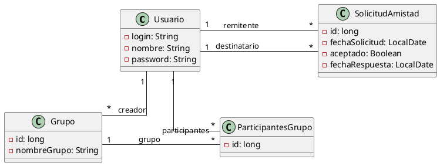

# Modelo de Clases

## Diagrama de Clases

```plantuml
@startuml
skinparam nodesep 200
skinparam linetype ortho

class Usuario {
  - login: String
  - nombre: String
  - password: String
}

class SolicitudAmistad {
  - id: long
  - fechaSolicitud: LocalDate
  - aceptado: Boolean
  - fechaRespuesta: LocalDate
}

class Grupo {
  - id: long
  - nombreGrupo: String
}

class ParticipantesGrupo {
  - id: long
}

Usuario "1" -right- "*" SolicitudAmistad : "remitente"
Usuario "1" -right- "*" SolicitudAmistad : "destinatario"
Usuario "1" -down- "*" Grupo : "creador"
Usuario "1" -down- "*" ParticipantesGrupo : "participantes"
ParticipantesGrupo "*" -left- "1" Grupo : "grupo"

@enduml
```
